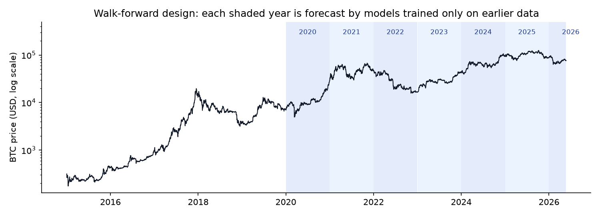
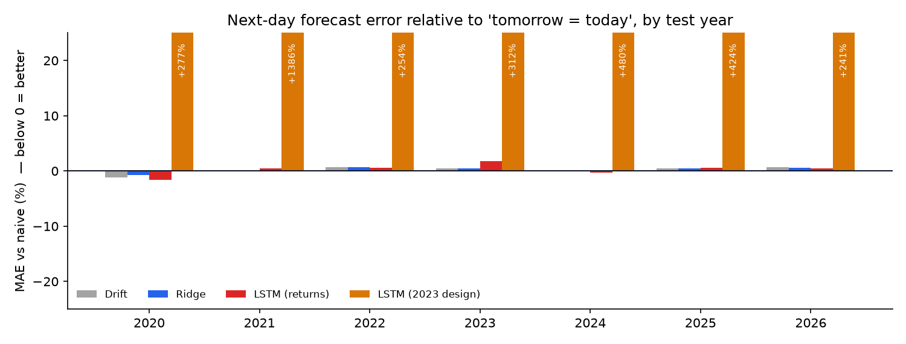
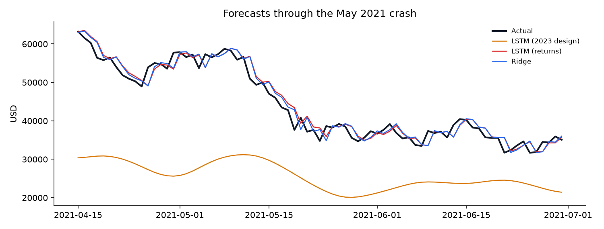

# Bitcoin Next-Day Price Forecasting: LSTMs vs Honest Baselines

Can a deep learning model forecast tomorrow's Bitcoin price better than assuming **tomorrow = today**?

This project started as a 2023 university LSTM project that reported "72.95% accuracy". Rebuilding it properly revealed that:

- a scaling bug had hidden the original model's real error, and
- once corrected, that error was **4.8× larger than the trivial "tomorrow = today" forecast**.

The rebuilt project audits that result, then tests LSTMs against baselines under a leakage-safe **walk-forward evaluation across 7 separate years (2020 to May 2026)**:

- A **redesigned LSTM that forecasts returns** matched the naive benchmark (MAE \$968 vs \$965) but did not beat it: the difference is not statistically significant (Diebold-Mariano p = 0.51).
- The **original 2023 design**, with its bug fixed, was **7× worse than naive** (MAE \$6,809). It forecasts price *levels*, so it can't predict prices above anything in its training data.



## Key findings

### 1. The 2023 model lost to a trivial baseline

The original notebook converted predictions back to dollars with a hard-coded factor, `y * (1 / 5.18e-05)`, instead of `scaler.inverse_transform`. That dropped the MinMax offset and used the wrong scale. The "real" prices in its chart peaked near \$11,500, but Bitcoin traded between \$16.6K and \$30.5K over that period.

Using only numbers the 2023 notebook printed, [`audit.py`](src/btcforecast/audit.py) recovers the scaler's minimum from the first test day. It then reconstructs the last test day's true price **to the cent**, which confirms the diagnosis.

| Same 114 test days (Jan–Apr 2023) | MAE |
|---|---:|
| 2023 LSTM, as printed | \$1,766 |
| 2023 LSTM, inverse scaling corrected | **\$2,257** |
| Naive "tomorrow = today" | **\$472** |

The reported "accuracy" (1 − MAE / mean price) isn't a meaningful metric either. On that test period, a model that always predicted the average price would score about 88%.

### 2. Walk-forward results, 2020 – May 2026

Every model forecasts the next day's price and is scored in US dollars on the same test days. The Diebold-Mariano (DM) test checks whether a model's errors differ from the naive forecast's by more than chance. A negative statistic with p < 0.05 would mean the model is genuinely better.

<!-- RESULTS:START -->
| Model | MAE (USD) | RMSE (USD) | MAPE | Direction | DM vs naive (p) |
|---|---:|---:|---:|---:|---:|
| Naive | 965 | 1,505 | 2.12% | – | – |
| Drift | 967 | 1,509 | 2.12% | 51.9% | +1.26 (0.208) |
| Ridge | 967 | 1,508 | 2.13% | 51.9% | +1.22 (0.222) |
| LSTM (returns) | 968 | 1,509 | 2.13% | 52.1% | +0.65 (0.514) |
| LSTM (2023 design) | 6,809 | 10,442 | 13.38% | 49.3% | +24.15 (< 0.001) |

- **Drift**: MAE +0.2% vs naive; not significantly different from naive (Diebold-Mariano p = 0.208).
- **Ridge**: MAE +0.2% vs naive; not significantly different from naive (Diebold-Mariano p = 0.222).
- **LSTM (returns)**: MAE +0.3% vs naive; not significantly different from naive (Diebold-Mariano p = 0.514).
- **LSTM (2023 design)**: MAE +605.7% vs naive; significantly worse than naive (Diebold-Mariano p < 0.001).
<!-- RESULTS:END -->

*This block is regenerated by `scripts/run_experiments.py` on each run.*



### 3. Why price charts flatter forecasting models



The forecasts track the actual price closely, but they're shifted one day to the right. A model that learns "tomorrow ≈ today" looks accurate on a chart while adding no information. That's why every model here is judged against the naive benchmark.

The orange line shows the 2023 design's failure. In early 2021 Bitcoin broke above its previous all-time high, so every price in the test year was above the training range. A model trained on MinMax-scaled price levels has never seen a value above 1, so its forecasts stay stuck around \$20–30K while the real price ranged from \$32K to \$63K. That year its error was about 15× the naive forecast's.

## Models

| Model | Input | Predicts | Notes |
|---|---|---|---|
| Naive | – | tomorrow = today | The benchmark |
| Drift | – | average historical daily return | Tests whether a trend alone helps |
| Ridge | last 30 days of returns + volume changes | next-day return | Regularisation tuned by time-series CV within training data |
| LSTM (2023 design) | last 60 days of MinMax-scaled price | next-day price | Original 4-layer architecture (50/60/80/120 units), inverse scaling fixed |
| LSTM (returns) | last 30 days of standardised returns + volume changes | next-day return | 1 × LSTM(32), dropout, Huber loss, early stopping, 3-seed ensemble |

**Why predict returns?** A model trained on MinMax-scaled price *levels* never sees values above the training maximum. So in rallies to new highs (2021, 2024) it has to extrapolate. Log returns stay in a similar range throughout, and a Huber loss limits the influence of extreme days: daily returns have an excess kurtosis of about 12.

## Evaluation design

- **Walk-forward, expanding window.** Each test year is forecast by models trained only on earlier days: 7 folds, with 1,795 to 3,987 training days each.
- **Leakage controls, covered by unit tests:**
  - the input window for day *j* ends on day *j − 1*;
  - scalers are fitted only on data before the test year;
  - early stopping validates on the most recent 15% of the training period.
- **Common scoring.** Every model's output is converted to a next-day price forecast and scored with MAE, RMSE, MAPE and directional accuracy, plus a DM test against naive.

## Run it

```bash
pip install -r requirements.txt
python -m pytest                               # leakage, conversion, metric and audit tests
python scripts/run_experiments.py              # full run (~20–40 min on a laptop CPU)
python scripts/run_experiments.py --skip-lstm  # baselines + audit only, in seconds (writes to results/partial_run/)
```

Or open [`notebooks/bitcoin_lstm_forecasting.ipynb`](notebooks/bitcoin_lstm_forecasting.ipynb) for the full walkthrough.

## Project structure

```
├── data/btc_daily_coinmetrics.csv   # daily BTC price + reported spot volume, 2014–2026
├── notebooks/                       # narrative walkthrough
├── results/                         # predictions, metrics and figures (generated)
├── scripts/run_experiments.py       # end-to-end experiment
├── src/btcforecast/
│   ├── audit.py        # reproduces and corrects the 2023 evaluation
│   ├── baselines.py    # naive, drift, ridge
│   ├── data.py         # loading + gap checks
│   ├── evaluate.py     # walk-forward folds, metrics, Diebold-Mariano test
│   ├── experiment.py   # model configuration
│   ├── features.py     # returns, leakage-safe windows and scaling
│   ├── lstm.py         # Keras LSTMs
│   └── plots.py        # figures and README tables
└── tests/test_pipeline.py
```

## Limitations and next steps

- Only price and volume history is used. Adding on-chain activity, funding rates or macro data may carry information that past prices don't.
- Forecasting the *size* of moves (volatility) is known to be more feasible than forecasting their direction, and would be a natural extension.
- A trading evaluation net of transaction costs would be the practical test of any signal.

## Data and credits

- **Data:** [Coin Metrics Community Data](https://github.com/coinmetrics/data), licensed [CC BY-NC 4.0](https://creativecommons.org/licenses/by-nc/4.0/). Columns used: `PriceUSD` and `volume_reported_spot_usd_1d`. See [`data/README.md`](data/README.md).
- **Authors:** Maanak Gadia and Kinjal Ahuja. The original 2023 project was completed at Nirma University; this rebuild and audit was completed in 2026.
- **Code licence:** MIT (see [`LICENSE`](LICENSE)). The data remains under its own licence.
